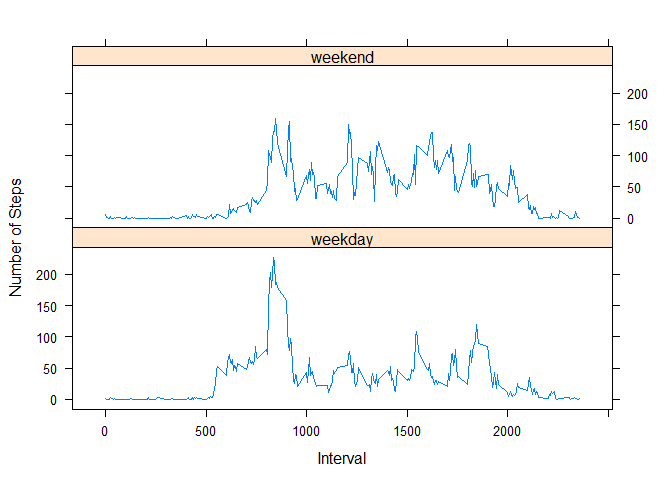

# Reproducible Research: Peer Assessment 1 By Mahmood Karimi


## Loading and preprocessing the data

```r
unzip("./activity.zip", exdir = "./data")
df <- read.csv("./data/activity.csv")
```


## What is mean total number of steps taken per day?

```r
agd <- aggregate(df$steps, by=list(df$date), FUN=sum)
names(agd) <- c("date", "sumsteps")
plot(agd)
```

<!-- -->

```r
summary(agd)
```

```
##          date       sumsteps    
##  2012-10-01: 1   Min.   :   41  
##  2012-10-02: 1   1st Qu.: 8841  
##  2012-10-03: 1   Median :10765  
##  2012-10-04: 1   Mean   :10766  
##  2012-10-05: 1   3rd Qu.:13294  
##  2012-10-06: 1   Max.   :21194  
##  (Other)   :55   NA's   :8
```


## What is the average daily activity pattern?

```r
tsa <- ts(agd, frequency = 365)
plot.ts(tsa)
```

<!-- -->

## Imputing missing values

```r
na_steps <- table(df[is.na(df$steps), "date"])
na_df <- as.data.frame(na_steps)
na_df[na_df$Freq > 0,]
```

```
##          Var1 Freq
## 1  2012-10-01  288
## 8  2012-10-08  288
## 32 2012-11-01  288
## 35 2012-11-04  288
## 40 2012-11-09  288
## 41 2012-11-10  288
## 45 2012-11-14  288
## 61 2012-11-30  288
```

```r
copy_date <- function(df1, from_date, to_date) {
        # df1[to_date, steps] <- df1[from_date, steps]
        t1df <- df1[df1$date != to_date,]
        t2df <- df1[df1$date == from_date,]
        t2df$date <- to_date
        df1 <- rbind(t1df, t2df)
        df1
}

set_avg <- function(df1, dt) {
        # copy the avg of steps to steps values in dt
        df2 <- aggregate(df1$steps, by=list(df1$interval), FUN=mean, na.rm=TRUE)
        names(df2) <- c("interval", "steps")
        df2$steps <- round(df2$steps)
        t1df <- df1[df1$date != dt,]
        t2df <- df1[df1$date == dt,]
        t2df[,c("interval", "steps")] <- df2
        df1 <- rbind(t1df, t2df)
        df1
}

df <- set_avg(df, "2012-10-01")
df <- copy_date(df, "2012-11-08","2012-10-08")
df <- copy_date(df, "2012-10-01","2012-11-01")
df <- copy_date(df, "2012-10-04","2012-11-04")
df <- copy_date(df, "2012-10-09","2012-11-09")
df <- copy_date(df, "2012-10-10","2012-11-10")
df <- copy_date(df, "2012-10-14","2012-11-14")
df <- copy_date(df, "2012-10-30","2012-11-30")

agd <- aggregate(df$steps, by=list(df$date), FUN=sum)
names(agd) <- c("date", "sumsteps")
plot(agd)
```

<!-- -->

```r
summary(agd)
```

```
##          date       sumsteps    
##  2012-10-01: 1   Min.   :   41  
##  2012-10-02: 1   1st Qu.: 8918  
##  2012-10-03: 1   Median :10762  
##  2012-10-04: 1   Mean   :10739  
##  2012-10-05: 1   3rd Qu.:12883  
##  2012-10-06: 1   Max.   :21194  
##  (Other)   :55
```


## Are there differences in activity patterns between weekdays and weekends?

```r
df$dow <- weekdays(as.Date(df$date))
df$holiday <- (df$dow == "شنبه" | df$dow == "يكشنبه")
df_we <- df[df$holiday,]
df_wd <- df[!df$holiday,]
agd_we <- aggregate(df_we$steps, by=list(df_we$interval), FUN=mean)
agd_wd <- aggregate(df_wd$steps, by=list(df_wd$interval), FUN=mean)
names(agd_we) <- c("interval", "meansteps_we")
names(agd_wd) <- c("interval", "meansteps_wd")
agd <- merge(agd_wd, agd_we, by="interval")
par(mfrow=c(1,2))
plot(agd$interval, agd$meansteps_wd)
plot(agd$interval, agd$meansteps_we)
```

<!-- -->
