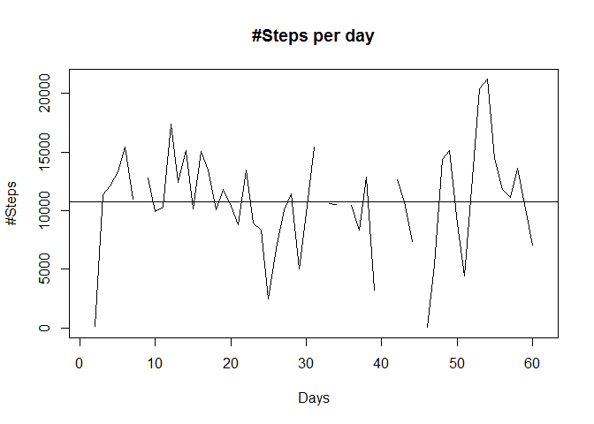

# Reproducible Research: Peer Assessment 1 By Mahmood Karimi
This project is about ananlysis of step-tracking data for two month of a person. We show you how has been the activity of the person during these two months.

## Loading and preprocessing the data

```r
library(lattice)
unzip("./activity.zip", exdir = "./data")
df <- read.csv("./data/activity.csv")
```


## What is mean total number of steps taken per day?

```r
agd <- aggregate(df$steps, by=list(df$date), FUN=sum)
names(agd) <- c("date", "sumsteps")
plot(agd$sumsteps, type = "l", main = "#Steps per day", xlab = "Days", 
     ylab = "#Steps")
abline(h=mean(agd$sumsteps, na.rm=TRUE))
```

<!-- -->

```r
hist(agd$sumsteps, breaks = nrow(agd), col = "green" ,main="Histogram of Total Daily Steps", xlab="Total Daily Steps")
```

<!-- -->
  
Summary(Mean, Median, ... of steps per day)

```r
summary(agd$sumsteps)
```

```
##    Min. 1st Qu.  Median    Mean 3rd Qu.    Max.    NA's 
##      41    8841   10760   10770   13290   21190       8
```

```r
boxplot(agd$sumsteps)
title("BoxPlot of Steps per day")
```

<!-- -->


## What is the average daily activity pattern?

```r
agd <- aggregate(df$steps, by=list(df$interval), FUN=mean, na.rm=TRUE)
names(agd) <- c("interval", "meansteps")
plot(agd$interval, agd$meansteps, type="l", main="Average Daily Activity pattern", xlab="Time", ylab="Steps")
```

<!-- -->

```r
t <- agd[agd$meansteps==max(agd$meansteps),]
```

The 835 interval contrains maximum number of steps on average.


## Imputing missing values
The strategy for imputing has been different. For the day that didn't have any similar equivalent in another month the mean of total days is used.  
For the days that had similar equivalent days, the corresponding equivalent day is used.

Days with NA values:

```r
# Finding the days with NA values
na_steps <- table(df[is.na(df$steps), "date"])
na_df <- as.data.frame(na_steps)
na_df[na_df$Freq > 0,]
```

```
##          Var1 Freq
## 1  2012-10-01  288
## 8  2012-10-08  288
## 32 2012-11-01  288
## 35 2012-11-04  288
## 40 2012-11-09  288
## 41 2012-11-10  288
## 45 2012-11-14  288
## 61 2012-11-30  288
```

```r
# Define two functons to impute NA values
copy_date <- function(df1, from_date, to_date) {
        # df1[to_date, steps] <- df1[from_date, steps]
        t1df <- df1[df1$date != to_date,]
        t2df <- df1[df1$date == from_date,]
        t2df$date <- to_date
        df1 <- rbind(t1df, t2df)
        df1
}

set_avg <- function(df1, dt) {
        # copy the avg of steps to steps values in dt
        df2 <- aggregate(df1$steps, by=list(df1$interval), FUN=mean, na.rm=TRUE)
        names(df2) <- c("interval", "steps")
        df2$steps <- round(df2$steps)
        t1df <- df1[df1$date != dt,]
        t2df <- df1[df1$date == dt,]
        t2df[,c("interval", "steps")] <- df2
        df1 <- rbind(t1df, t2df)
        df1
}

# Imputing the NA values
df <- set_avg(df, "2012-10-01")
df <- copy_date(df, "2012-11-08","2012-10-08")
df <- copy_date(df, "2012-10-01","2012-11-01")
df <- copy_date(df, "2012-10-04","2012-11-04")
df <- copy_date(df, "2012-10-09","2012-11-09")
df <- copy_date(df, "2012-10-10","2012-11-10")
df <- copy_date(df, "2012-10-14","2012-11-14")
df <- copy_date(df, "2012-10-30","2012-11-30")

# Drawing the result
agd <- aggregate(df$steps, by=list(df$date), FUN=sum)
names(agd) <- c("date", "sumsteps")
par(col="red", las=0)
plot(agd$sumsteps, type = "l", main = "#Steps per day (After Imputing null values)", xlab = "Days", ylab = "#steps")
abline(h=mean(agd$sumsteps))
```

<!-- -->

```r
hist(agd$sumsteps, breaks = nrow(agd), col = "green", main="Histogram of Total Daily Steps (After Imputing null values)", xlab="Total Daily Steps")
```

<!-- -->

```r
summary(agd$sumsteps)
```

```
##    Min. 1st Qu.  Median    Mean 3rd Qu.    Max. 
##      41    8918   10760   10740   12880   21190
```


## Are there differences in activity patterns between weekdays and weekends?

```r
for(i in 1:nrow(df)) {
        if (chron::is.weekend(df$date[i]) == TRUE) {
            df$day.type[i] <- "weekend"
        } else {
            df$day.type[i] <- "weekday"
        }
}
Steps.by.day3 <- with(df, aggregate(steps, by=list(interval, day.type), FUN="mean"))
    names(Steps.by.day3) <- c("interval", "day.type", "steps")
    xyplot(steps ~ interval | day.type, Steps.by.day3, type="l", 
           layout=c(1,2),
           xlab="Interval",
           ylab="Number of Steps")
```

<!-- -->
